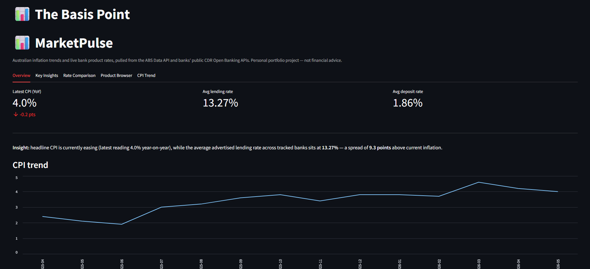
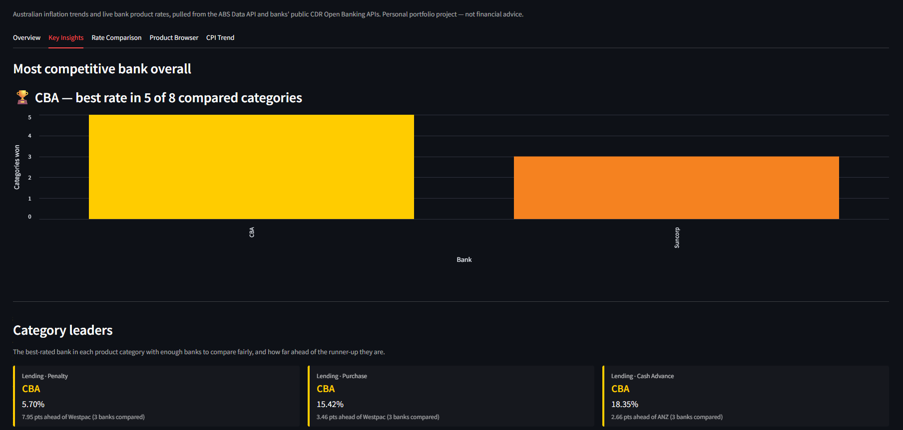
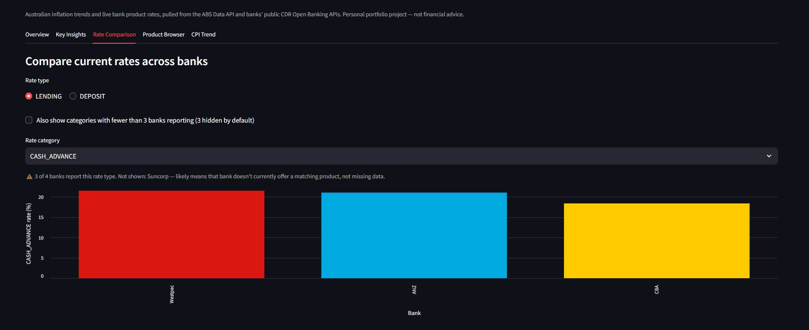

# The Basis Point

**A live, automatically-updating dashboard tracking how Australian banks price
against inflation — extraction, orchestration, transformation, testing, and
visualization, running end-to-end with zero manual triggers, built entirely
on free infrastructure.**

*(Internal codebase name: `marketpulse` — folder structure and internal
references below still use this name; it's just not the public-facing title.)*


---

## Live dashboard

**🔗 [https://marketpulse-lqstbzqnvpb767grnr6c3x.streamlit.app/](https://marketpulse-lqstbzqnvpb767grnr6c3x.streamlit.app/)**

This is a genuinely live, publicly deployed dashboard — not a local
screenshot. It reads directly from Supabase, which refreshes automatically
every day with no manual trigger (see "Automation & CD" below).





---

## The question this project answers

> Given where Australian inflation and lending conditions are heading, how
> competitively are the major banks actually pricing their loan and deposit
> products right now — and which bank comes out ahead in which category?

This is the same question comparison sites like Canstar and Finder answer
commercially, and the same question a bank's own pricing/strategy team asks
when benchmarking against competitors.

---

## Architecture

```
                 ┌────────────────────┐        ┌──────────────────────┐
                 │  ABS Data API      │        │  CDR Bank APIs        │
                 │  (macro/CPI data)  │        │  (product + rate data)│
                 └─────────┬──────────┘        └──────────┬───────────┘
                           │                                │
                           └──────────────┬─────────────────┘
                                          ▼
                              Extraction (Python)
                        · SDMX/CSV parsing (ABS)
                        · Per-endpoint API version
                          auto-negotiation (CDR)
                        · Graceful per-bank failure
                          handling
                                          │
                                          ▼
                    BRONZE — Raw storage (Postgres / Supabase)
                        · Append-only, timestamped snapshots
                        · Untouched, exactly as received
                                          │
                                          ▼
                    SILVER — dbt staging models
                        · Cleaning, renaming, type-casting
                        · Still one row per raw record
                                          │
                                          ▼
                    GOLD — dbt mart models
                        · Deduplication to latest snapshot
                        · Business joins, ready to query
                                          │
                                          ▼
                          Streamlit dashboard (LIVE)
                        · Overview, Key Insights,
                          Rate Comparison, Product
                          Browser, CPI Trend

  Automation: GitHub Actions scheduled workflow — runs extraction + dbt
  daily, with NO manual trigger, free and unlimited on a public repo.

  Orchestration (demonstrated separately): a Dockerized Apache Airflow DAG,
  built and validated, showing the same pipeline logic in a different
  orchestration paradigm — not the live production scheduler (see
  "Automation & CD" below for why).

  CD: Streamlit Community Cloud auto-redeploys the dashboard on every push.

  CI: GitHub Actions — lint, format-check, and unit tests on every push.
```

---

## This project implements a medallion architecture

Medallion architecture organizes data into three progressively cleaner
layers. This project implements exactly that pattern, even though it wasn't
originally built under that label:

| Medallion layer | What it means | This project's actual component |
|---|---|---|
| **Bronze** | Raw, untouched, exactly as received | `raw.abs_cpi`, `raw.cdr_products`, `raw.cdr_product_rates` in Supabase — written directly from the Python extraction scripts, append-only |
| **Silver** | Cleaned, typed, standardized, still detailed | dbt **staging models** (`stg_abs_cpi`, `stg_cdr_products`, `stg_cdr_product_rates`) — renamed columns, cast types, dropped redundant fields |
| **Gold** | Business-ready, aggregated, dashboard-facing | dbt **mart models** (`fct_cpi_trend`, `fct_bank_products_latest`, `fct_bank_rates_latest`) — deduplicated to the latest snapshot per key, joined together, queried directly by the dashboard |

---

## Automation & CD — this pipeline runs with zero manual triggers

**The ETL side (the actual "production" automation):**
A scheduled GitHub Actions workflow (`.github/workflows/scheduled_pipeline.yml`)
runs daily: extraction → load to Supabase → `dbt run` → `dbt test`. No one
needs to open a laptop, start a Codespace, or click anything — GitHub's own
infrastructure runs this on schedule, and it's free and unlimited on a
public repository.

**The dashboard side (the actual CD):**
Deployed on Streamlit Community Cloud, connected directly to this GitHub
repo. Every push to `main` automatically triggers a redeploy — genuine
continuous deployment, not just continuous integration.

**An honest note on why Airflow isn't the live scheduler:**
The Dockerized Airflow DAG in this repo is real, working, and was validated
end-to-end — it's a genuine demonstration of orchestration skill. But
keeping a persistent Airflow instance running 24/7 isn't achievable for
free (GitHub Codespaces caps free usage at 60 core-hours/month, which a
constantly-running scheduler would exhaust in days). Rather than pretend
otherwise, this project uses GitHub Actions' own scheduling as the actual
production automation, and keeps the Airflow build as a separate,
demonstrated artifact. This is a legitimate, commonly-used trade-off for
pipelines at this scale — not a shortcut hiding a gap.

---

## What was actually built

### 1. Extraction
- **`extract_abs.py`** — pulls Australian CPI data from the ABS Data API,
  using a labelled-CSV response format after finding it far more reliable
  to parse than raw SDMX-JSON. Filtered from an initial 197,736-row
  unfiltered pull down to the correct 14-month headline series after
  manually inspecting the API's dimension structure.
- **`extract_cdr_products.py`** — pulls live product listings from 4
  Australian banks' public Consumer Data Right (Open Banking) APIs: ANZ,
  Westpac, CBA, and Suncorp.
- **`extract_cdr_product_rates.py`** — pulls the actual interest rate detail
  for every product. Includes **automatic API version negotiation**: each
  bank's product detail endpoint requires a different, undocumented API
  version, and each phrases its version-mismatch error differently. The
  extractor reads each bank's own error response, parses out the version it
  wants (handling three different real-world phrasings, including a
  response-header fallback for banks that don't state it in the error body),
  retries automatically, and caches the working version per bank.

### 2. Storage
Free-tier hosted Postgres via Supabase, reached through the Session Pooler
(the direct connection is IPv6-only and doesn't work reliably on most
networks). Every extraction run **appends** a timestamped snapshot rather
than overwriting.

### 3. Transformation (dbt)
Staging and mart models as described in the medallion table above, with
**16 automated data tests** — which genuinely caught a real bug during
development: the CPI mart initially lacked the same deduplication logic as
the product mart, surfaced by a `unique` test failing the moment a second
pipeline run created real duplicate data to test against.

### 4. Orchestration
A fully Dockerized Apache Airflow setup (webserver, scheduler, its own
metadata database) running a 3-task DAG: extract → transform → test.

### 5. CI/CD
- **CI:** GitHub Actions runs linting (flake8), formatting checks (black),
  and a unit test suite (pytest, with all external API calls mocked) on
  every push.
- **CD:** covered above — scheduled ETL via GitHub Actions, automatic
  dashboard redeployment via Streamlit Community Cloud.

### 6. Visualization
A Streamlit dashboard with five tabs — Overview, Key Insights (auto-ranked
category leaders per bank), Rate Comparison, Product Browser, and CPI
Trend — using a consistent colour per bank across every chart.

---

## Why this is relevant beyond a portfolio exercise

This mirrors a real, existing commercial function: comparison sites like
Canstar and Finder exist specifically to answer "which bank has the best
rate right now"; bank pricing teams benchmark against competitors using
data structured exactly like this; fintechs use signals like "where is the
market underpriced" to time customer acquisition. The Consumer Data Right
data source used here is genuinely public, genuinely live, and rarely
appears in portfolio projects, since most default to static Kaggle CSVs
instead of real regulatory APIs.

---

## Known limitations

- **AMP is excluded** — its CDR endpoint returns a persistent,
  unresolvable version-negotiation error regardless of the version
  requested, pointing to a bug in AMP's own implementation.
- **Individual banks occasionally have transient API failures** (observed
  with Westpac) — the pipeline logs a warning and continues rather than
  failing the whole run.
- **This is a portfolio-scale build**, not an enterprise production system —
  it runs on free-tier infrastructure and doesn't carry the volume or
  reliability guarantees a commercial deployment would require.

---

## Project structure

```
marketpulse/
  src/
    extract_abs.py
    extract_cdr_products.py
    extract_cdr_product_rates.py
    load_raw.py
    utils/db.py
  marketpulse_dbt/
    models/staging/
    models/marts/
  dags/
    marketpulse_pipeline.py        # Airflow DAG (demonstrated, not live scheduler)
  streamlit_app/
    app.py                          # live dashboard
  tests/
  .github/workflows/
    ci.yml                          # lint + test on every push
    scheduled_pipeline.yml          # daily automated ETL — the real production scheduler
  Dockerfile, docker-compose.yaml
  requirements.txt
  NOTES.md
```

## Setup

1. Create a free Supabase project — use the Session Pooler connection string.
2. Copy `.env.example` to `.env` and fill in `DATABASE_URL`.
3. `pip install -r requirements.txt`
4. `python src/load_raw.py`
5. `cd marketpulse_dbt && dbt run && dbt test`
6. `streamlit run streamlit_app/app.py`
7. For scheduled automation: add `DATABASE_URL`, `SUPABASE_HOST`,
   `SUPABASE_USER`, `SUPABASE_PASSWORD` as GitHub repo secrets — the
   `scheduled_pipeline.yml` workflow handles the rest automatically.

---

*Personal portfolio project. Not financial advice.*